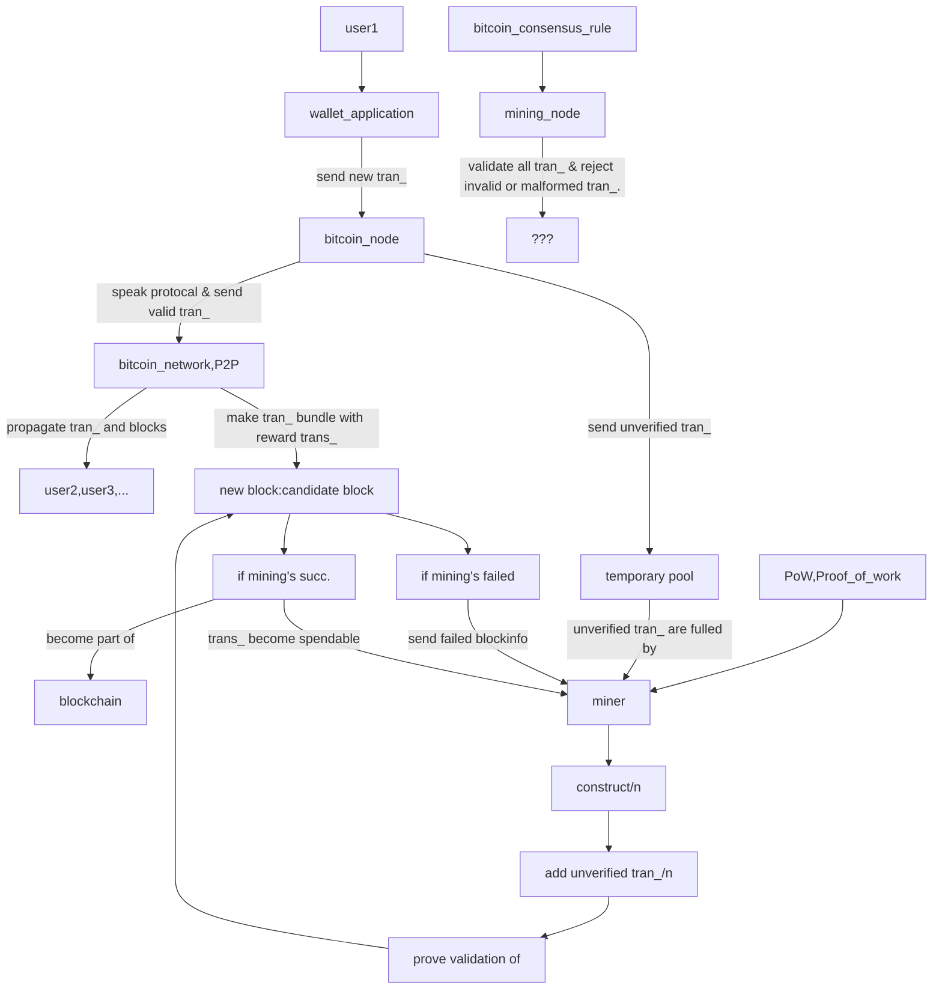

```mermaid
graph TB
var0[user1]
var1[wallet_application]
var2[bitcoin_node]
var4[blockchain]
var5[user2,user3,...]
var3[bitcoin_network,P2P]
var6[new block:candidate block]
var7[mining_node]
var8[???]
var9[bitcoin_consensus_rule]
var10[PoW,Proof_of_work]
var11[temporary pool]

var0-->var1
var1-->|send new tran_|var2
var2-->|speak protocal & send valid tran_|var3
var2-->|send unverified tran_|var11
var3-->|make tran_ bundle with reward trans_|var6
var3-->|propagate tran_ and blocks|var5
var7-->|validate all tran_ & reject invalid or malformed tran_.|var8
var9-->var7

var12[miner]
var10-->var12
var11-->|unverified tran_ are fulled by|var12

var13[construct/n]
var14[add unverified tran_/n]
var15[prove validation of]

var12-->var13
var13-->var14
var14-->var15
var15-->var6

var16[if mining's succ.]
var17[if mining's failed]
var17-->|send failed blockinfo|var12

var6-->var17
var6-->var16
var16-->|become part of |var4
var16-->|trans_ become spendable|var12
```

